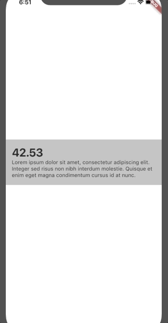

# Animations

Flutter animation samples.

Mostly widgets that mimic various animations I see on concept sites such as Dribbble.

## Carousel

Widget that takes in a list of children and animates them in a view pager like fashion. The exiting element 
will shrink and leave the screen while the next element grows and enters.

## AnimatedSingleChart

Bar chart that animates into its container. Values are given as a list of objects that have respresentations
as doubles. Stroke colors and gradient color are customizable. In the future I want to add a title and 
left / bottom markers to display more data.
